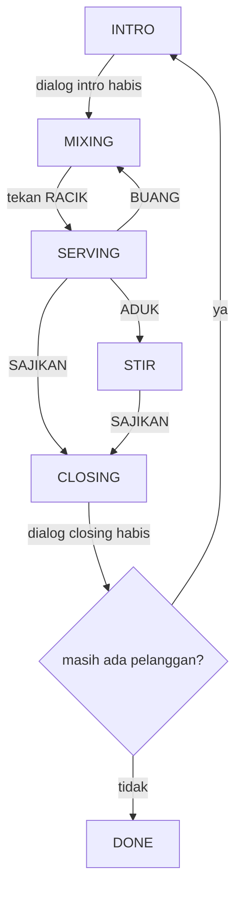

# Busa Fantasi — Arsitektur & Logika Kode

Dokumen teknis: bagaimana script, class, variable, signal, dan function saling
terhubung. Untuk panduan pemakaian (tambah dialog, ganti aset), lihat
[README.md](README.md).

---

## 1. Soal file `.gd.uid`

Mulai **Godot 4.4+**, setiap script `.gd` punya pendamping `.gd.uid` (mis.
`level1.gd.uid`) berisi satu ID unik, contohnya `uid://dxakgk5gjcksa`.

- **Fungsinya:** Godot melacak script lewat UID ini, bukan lewat path. Jadi saat
  file dipindah atau di-rename, semua referensi (di `.tscn`, `.tres`, `preload`)
  tetap nyambung.
- **Badge "U"** di FileSystem editor = penanda file punya UID.
- **Aturan:** jangan diedit/dihapus manual, dan **ikut commit ke git**. Kalau
  dihapus, Godot bikin UID baru → referensi yang memakai UID lama bisa putus.

Hal yang sama berlaku untuk resource: `.tscn` dan `.tres` juga punya `uid="..."`
di baris header-nya.

---

## 2. Konsep arsitektur: *Scene Composition* + *Coordinator*

Game ini **bukan** satu scene raksasa. Polanya:

- **Satu scene koordinator** ([level1.tscn](scenes/chapters/level1.tscn) +
  [level1.gd](scripts/systems/level1.gd)) yang **meng-instance** beberapa
  **panel** sebagai anak.
- **Tiap fase = satu panel sub-scene** yang berdiri sendiri (punya `.tscn` +
  `.gd` sendiri), bisa dijalankan terpisah (F6) dan di-reskin terpisah.
- Koordinator hanya mengatur **state machine** + **kapan panel meluncur** (slide).
  Isi tiap panel diurus panel-nya sendiri.
- **LAYOUT panel dibuat di EDITOR**, bukan digenerate kode. Kotak/tombol/judul =
  node di `.tscn` (bisa digeser & diedit visual). Script panel = **logika saja**
  (sambung tombol, animasi, dll). Pengecualian: **rak 6 bahan** di MixingPanel
  diisi kode ke `GridContainer` (pola standar "daftar dari data").

```
Level1 (Control)  ← level1.gd: state machine + orkestrasi transisi
├── Background              (PlaceholderBox)         latar kamar mandi
├── MixingPanel             (MixingPanel)            rak bahan + slot + RACIK
├── ServePanel              (ServePanel)             BUANG / ADUK / SAJIKAN
├── CustomerPortraitPanel   (CustomerPortraitPanel)  wajah pelanggan (geser kiri/tengah)
├── StirCanvas (CanvasLayer, layer 5)
│   └── StirPanel           (StirPanel)              minigame mengaduk (full-screen)
└── DebugCanvas (CanvasLayer, layer 10)
    └── DebugLabel          (Label)                  info state saat dev
```

> **Dialog dirender oleh addon Dialogic**, bukan node panel sendiri. Saat fase
> INTRO/CLOSING, `level1.gd` memanggil `Dialogic.start(timeline)` — Dialogic
> menampilkan kotak dialognya sendiri (CanvasLayer-nya sendiri) dan otomatis
> menghapusnya saat timeline selesai. Lihat §9.

**Kenapa StirPanel di CanvasLayer terpisah?** Supaya saat minigame aduk muncul,
ia menutupi *seluruh* layar di atas panel split. (Catatan: kalau `visible`
CanvasLayer ini tidak sengaja dimatikan di editor, panel aduk tak akan muncul.)

---

## 3. State machine (alur fase)

Enum `Phase` di [level1.gd](scripts/systems/level1.gd):
`INTRO, MIXING, SERVING, STIR, CLOSING, DONE`.



Arah transisi (slide):
- INTRO → MIXING: dialog keluar ke kiri, **pelanggan meluncur ke kiri**, rak
  masuk **dari kanan**.
- MIXING → SERVING: rak keluar ke kiri, panel serve masuk **dari kanan**.
- SERVING → STIR: panel aduk turun **dari atas**, full-screen.
- * → CLOSING: panel-panel mundur, pelanggan kembali ke tengah, dialog closing.
- CLOSING → INTRO (pelanggan berikut): pelanggan lama **fade-out**, pelanggan
  baru **fade-in** dengan nama/aset berbeda.

---

## 4. Hierarki class

```
Resource
 ├── IngredientDef        (ingredient_def.gd)   data 1 bahan
 └── CustomerData         (customer_data.gd)    data 1 pelanggan / "level"

Control
 ├── PlaceholderBox       (placeholder_box.gd, @tool)   greybox bisa di-skin
 └── CraftPanel           (panel_base.gd)               BASE semua panel
      ├── CustomerPortraitPanel    (customer_portrait_panel.gd)
      ├── MixingPanel              (mixing_panel.gd)
      ├── ServePanel               (serve_panel.gd)
      └── StirPanel                (stir_panel.gd)

(Dialog ditangani addon Dialogic, bukan class panel — lihat §9.)

Control (langsung)
 └── Level1 koordinator   (level1.gd)           tidak pakai class_name
```

---

## 5. Rincian tiap file

### `ingredient_def.gd` — `class_name IngredientDef extends Resource`
Data satu bahan. Disimpan sebagai file `.tres` di `resources/ingredients/`.

| Export | Tipe | Guna |
|---|---|---|
| `id` | String | kode bahan, huruf kecil (mis. "sabun", "shampo") — dipakai di `recipe` |
| `display_name` | String | nama tampil di rak/slot (mis. "Sabun Batang") |
| `placeholder_color` | Color | warna greybox |
| `texture` | Texture2D | gambar bahan (kosong = greybox) |

Id yang dipakai: `sabun, shampo, pasta, bedak, mint, garam`.

### `customer_data.gd` — `class_name CustomerData extends Resource`
Data satu pelanggan / "level". File `.tres` di `resources/customers/`.

| Export | Guna |
|---|---|
| `id`, `display_name` | identitas + nama tampil |
| `npc_color`, `npc_texture` | warna/gambar portrait |
| `recipe : PackedStringArray` | bahan ideal (id, maks 3), penentu hasil & reaksi — TIDAK ada skor |
| `result_perfect / result_partial / result_wrong` | nama busa di layar serve, by tier |
| `intro_lines : PackedStringArray` | dialog sebelum meracik (beri petunjuk) |
| `react_perfect / react_partial / react_wrong` | reaksi setelah disajikan, dipilih by jumlah bahan benar |
| `intro_timeline : DialogicTimeline` | opsional, override intro pakai timeline `.dtl` |
| `background_color`, `background_texture` | latar opsional (override default) |

Mekanik hasil & reaksi (di `level1.gd`): `_match_tier(pelanggan, racikan)` hitung
berapa id `recipe` ada di racikan → **2** = semua benar+tanpa bahan lain, **1** = ≥1 benar,
**0** = 0 benar. Tier yang sama dipakai dua kali:
- `_result_name()` → nama busa di kotak HASIL RACIKAN (saat tekan RACIK)
- `_pick_reaction()` → dialog reaksi (saat tekan SAJIKAN)

Murni ganti nama + dialog, **tanpa skor/bintang**.

### `placeholder_box.gd` — `@tool class_name PlaceholderBox extends Control`
Greybox serbaguna untuk SEMUA visual statis. **Kontrak swap aset:** isi
`texture` → kotak warna + label diganti gambar; kosong → tetap greybox.

- Export: `display_name`, `texture`, `box_color`
- Signal: `clicked` (klik kiri)
- Internal: `_color_rect`, `_texture_rect`, `_label` (dibuat runtime, owner=null)
- Function: `pop()` (efek valid), `flash_error()` (efek invalid), `_rebuild()`

### `panel_base.gd` — `class_name CraftPanel extends Control`
**Base class** semua panel fase. Tiap panel full-screen (1920×1080) dan
meluncur masuk/keluar. Panel **memiliki** tween slide-nya sendiri.

- `enum Dir { LEFT, RIGHT, TOP, BOTTOM }`
- `const DESIGN_SIZE := Vector2(1920, 1080)`
- `const PlaceholderBoxScene := preload(".../placeholder_box.tscn")`
- `_ready()` → set anchor+size, panggil `_build()`
- `_build()` → **virtual**, di-override tiap subclass untuk mengisi konten
- `slide_in(dir, dur)` / `slide_out(dir, dur)` → animasi geser
- `place_off(dir)` / `place_center()` → set posisi tanpa animasi
- `make_box(text, rect, color, ignore_mouse)` → spawn PlaceholderBox anak
- `make_title(text, top_left, width)` → label judul di atas frame
- `apply_texture(box, tex)` → pasang tekstur kalau tidak null (hook swap aset)

### Dialog (Fase 1 / INTRO & CLOSING) — ditangani **addon Dialogic**
Tidak ada lagi `dialogue_panel.gd`. Teks dialog dirender Dialogic. Yang relevan
ada di `level1.gd._play_dialogue()` (lihat §9). Wajah pelanggan tetap diurus
`CustomerPortraitPanel` (terpisah, supaya tidak hilang saat transisi).

### `customer_portrait_panel.gd` — `class_name CustomerPortraitPanel extends CraftPanel`
Satu portrait pelanggan yang **persisten** (tidak dihancurkan saat ganti fase),
hanya bergeser/fade.

- `CENTER_POS` (saat ngobrol) ↔ `LEFT_POS` (saat split)
- `configure(nama, color, tex)` → reskin untuk pelanggan berbeda
- `move_to_center()` / `move_to_left()` → geser
- `fade_in()` / `fade_out()` → untuk pergantian pelanggan
- `set_center_instant()` → snap tanpa animasi

### `mixing_panel.gd` — `class_name MixingPanel extends CraftPanel`
Fase 2. Rak bahan (data-driven) + 3 slot + tombol ULANGI/RACIK.

- Signal: **`mix_requested(contents: Array)`**
- `const MAX_SLOTS := 3`
- Export: `ingredients : Array[IngredientDef]`, `frame_texture`, `slot_texture`
- `contents : Array[String]` → id bahan yang dipilih
- Klik bahan → masuk slot (maks 3, ke-4 ditolak `flash_error`)
- Klik slot terisi → kosongkan
- `RACIK` (aktif jika ≥1) → emit `mix_requested`
- `_load_default_ingredients()` → kalau array kosong, load 6 `.tres` default
- `_refresh_slots()` → slot terisi tampil tekstur bahan (kalau ada)

### `serve_panel.gd` — `class_name ServePanel extends CraftPanel`
Fase 3. Hasil racikan + 3 pilihan.

- Signal: **`trash_requested`**, **`serve_requested`**, **`stir_requested`**
- Export: `frame_texture`, `result_texture`
- Tombol BUANG → `trash_requested`, ADUK → `stir_requested`, SAJIKAN → `serve_requested`
- `set_result(text)` → ubah label kotak hasil

### `stir_panel.gd` — `class_name StirPanel extends CraftPanel`
Fase 4. Minigame aduk **rotary** (full-screen, di CanvasLayer).

- Signal: **`serve_requested`**
- `const MAX_STIR := 5`
- Export: `backdrop_texture`, `vessel_texture` (gayung), `spoon_texture` (sendok)
- `stir_count`, `_accum_angle` → progres putaran
- `_gui_input()` → tekan + seret melingkar di dalam gayung; akumulasi sudut
- 1 putaran penuh (TAU) = 1 aduk; 5 putaran = "rata sempurna"
- `reset_stir()` → reset hitungan

### `level1.gd` — koordinator (`extends Control`, tanpa `class_name`)
Otak alur. Memegang state machine + orkestrasi.

- `enum Phase { INTRO, MIXING, SERVING, STIR, CLOSING, DONE }`
- Export: `customers : Array[CustomerData]` (kosong → `_load_default_customers()`
  auto-scan SEMUA `.tres` di `res://resources/customers/`, urut nama file)
- `@onready` refs: `background, mixing_panel, serve_panel, customer_portrait,
  stir_panel, debug_label`
- `_ready()` → sambungkan semua signal (termasuk `Dialogic.timeline_ended`),
  parkir panel off-screen, mulai pelanggan 0
- `_start_customer(i)` / `_advance_customer()` → siklus pelanggan + fade
- `_play_dialogue(timeline, lines)` → start dialog via Dialogic (lihat §9)
- `_racikan_terakhir : Array` → bahan terakhir yang diracik (disimpan saat RACIK)
- `_match_tier()` / `_result_name()` / `_pick_reaction()` → resep → nama hasil + reaksi
- Handler: `_on_dialogue_done, _go_to_mixing, _on_mix_requested, _on_trash,
  _on_stir, _on_serve`
- Guard tombol aksi berbasis **phase** (bukan `sedang_transisi`) supaya klik
  tak hilang saat transisi.

---

## 6. Peta aliran signal (siapa emit → siapa nyambung)

Semua koneksi dibuat di `level1.gd._ready()`:

| Emitter | Signal | Handler di Level1 | Akibat |
|---|---|---|---|
| **Dialogic** (autoload) | `timeline_ended` | `_on_dialogue_done` | INTRO→MIXING / CLOSING→pelanggan berikut |
| MixingPanel | `mix_requested` | `_on_mix_requested` | MIXING→SERVING |
| ServePanel | `trash_requested` | `_on_trash` | SERVING→MIXING |
| ServePanel | `stir_requested` | `_on_stir` | SERVING→STIR |
| ServePanel | `serve_requested` | `_on_serve` | SERVING→CLOSING |
| StirPanel | `serve_requested` | `_on_serve` | STIR→CLOSING |

Di dalam tiap panel, tombol/aksi memanggil signal lewat `Button.pressed`
(mis. `_add_button` di ServePanel) atau `PlaceholderBox.clicked` (mis. bahan di
MixingPanel).

---

## 7. Aturan menumpuk (z-order) & input

- Urutan anak di `level1.tscn` = urutan gambar (yang bawah = di atas).
- `CustomerPortraitPanel` di atas Mixing/Serve tapi **`mouse_filter = IGNORE`**
  → klik tembus ke panel di bawahnya.
- `StirCanvas` (CanvasLayer 5) menggambar di atas semua panel base.
- `DebugCanvas` (CanvasLayer 10) paling atas (label dev selalu kelihatan).
- Frame greybox besar dibuat **tanpa label tengah** (judul pakai `make_title`
  di atas) supaya teks tidak nembus ke kontrol di belakangnya.

---

## 8. Resolusi & koordinat

- Desain di **1920×1080**, stretch `canvas_items`, aspect `keep`.
- Semua posisi/rect di kode dalam koordinat desain 1920×1080.
- Panel di-set full-rect (1920×1080) lalu digeser via `position`.

---

## 9. Integrasi Dialogic (dialog)

Dialog memakai addon **Dialogic 2** (autoload `Dialogic`, sudah di `project.godot`).

**Cara kerja di kode** ([level1.gd](scripts/systems/level1.gd)):

```gdscript
func _play_dialogue(timeline_res: DialogicTimeline, lines: PackedStringArray):
    var tl := timeline_res
    if tl == null:                       # tidak ada timeline → bangun dari teks
        tl = DialogicTimeline.new()
        tl.from_text("\n".join(lines))   # tiap baris = 1 text event
    Dialogic.start(tl)                   # Dialogic tampilkan kotak dialognya
```

- `Dialogic.start()` otomatis memuat **VN style default** bawaan addon (karena
  `style_directory` kosong) lalu menampilkan kotak dialog di CanvasLayer-nya.
- Input maju dialog (klik/spasi) sudah disiapkan via action `dialogic_default_action`
  di `project.godot`.
- Saat timeline habis, Dialogic **otomatis menghapus** layout-nya (setting
  `dialogic/layout/end_behaviour=0`) lalu emit **`Dialogic.timeline_ended`**.
- `level1.gd` menyambung `timeline_ended` → `_on_dialogue_done()` → lanjut fase
  sesuai `phase` (INTRO→MIXING, atau CLOSING→pelanggan berikut).

**Konten dialog (di CustomerData):**
- **Intro** (sebelum meracik): isi `intro_lines` (teks) → di-feed ke Dialogic via
  `from_text`. Cara penuh: buat timeline `.dtl` di editor Dialogic & assign ke
  `intro_timeline` (override `intro_lines`; dapat nama/portrait/pilihan).
- **Closing** (reaksi setelah disajikan): pakai `react_perfect/partial/wrong` —
  dipilih otomatis oleh `_match_tier` (lihat §5), lalu di-feed ke Dialogic juga.
  (Tidak ada `closing_lines`/`closing_timeline` lagi — diganti sistem reaksi.)

**Catatan:** addon Dialogic 2-Alpha-19 memunculkan **warning UID** ("invalid UID …
using text path instead") saat run — itu dari file addon-nya sendiri, **tidak
berbahaya**, dan tidak memengaruhi jalannya game.
