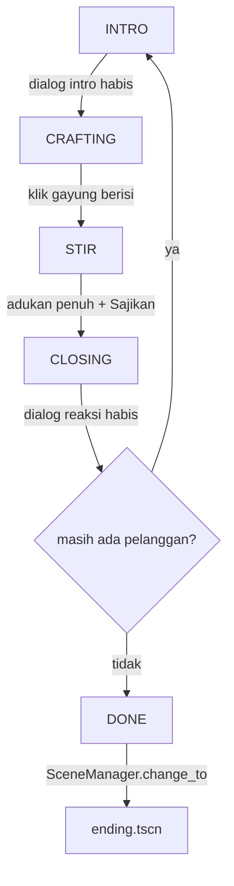

# Busa Fantasi — Arsitektur & Logika Kode

Dokumen teknis: bagaimana scene, class, signal, dan autoload saling terhubung.
Untuk panduan pemakaian (tambah pelanggan, ganti aset), lihat [README.md](README.md).

> Engine **Godot 4.6**, desain **1920×1080** (stretch `canvas_items`, aspect `keep`).

---

## 1. File `.gd.uid`, `.tscn`, `.tres`
Godot 4.4+ memberi tiap script `.gd` pendamping `.gd.uid` berisi ID unik
(`uid://...`). Godot melacak file lewat UID ini, bukan path — jadi rename/pindah
tidak memutus referensi. **Jangan diedit/dihapus manual; ikut commit ke git.**
`.tscn` & `.tres` juga punya `uid=` di header.

---

## 2. Autoload (singleton global)
Terdaftar di `project.godot [autoload]`:

| Autoload | File | Guna |
|---|---|---|
| `Dialogic` | addon | render dialog (VN box) |
| `SceneManager` | [scene_manager.gd](scripts/systems/scene_manager.gd) | transisi scene (fade) + tumpukan overlay |
| `GameState` | [game_state.gd](scripts/systems/game_state.gd) | state machine mode game (TITLE/DIALOG/CRAFTING/…) |
| `SaveManager` | [save_manager.gd](scripts/systems/save_manager.gd) | save/load **progres** (`user://busa_save.json`) |
| `SettingsManager` | [settings_manager.gd](scripts/systems/settings_manager.gd) | **pengaturan** volume, persist + apply ke AudioServer |
| `AudioManager` | scene [audio_manager.tscn](scenes/systems/audio_manager.tscn) + [.gd](scripts/systems/audio_manager.gd) | pintu semua audio: BGM (bus "BGM") + SFX pool (bus "SFX") |

- **SceneManager:** `change_to(path, fade)` = fade-out → ganti scene → fade-in
  (CanvasLayer internal + ColorRect). `push_overlay/pop_overlay` = UI di atas scene
  tanpa menghancurkannya (mis. Pengaturan). Sinyal `scene_changed`.
- **SaveManager vs SettingsManager:** sengaja **terpisah** — progres game ≠ config
  pemain (praktik profesional). Save = JSON; Settings = ConfigFile.
- **AudioManager** adalah autoload **SCENE** (bukan sekadar script) supaya slot
  `AudioStream` (BGM/SFX) bisa **diisi lewat Inspector di editor**. `play_bgm(key)`
  = crossfade antar lagu (per scene); `play_sfx(key)` = ambil 1 player idle dari
  pool. Slot kosong = no-op (aman). Volume ikut bus (SettingsManager).

---

## 3. Alur scene (satu game penuh)
```
main_menu ──Mulai──> intro ──> level1 ──(DONE)──> ending ──> credits ──> main_menu
             └Lanjutkan──────> level1 (dari save)
```
Semua transisi lewat `SceneManager.change_to(...)`. **intro, ending, credits**
memakai **AnimationPlayer** untuk sinematik/scroll (lihat §8).

---

## 4. level1 — koordinator gameplay
[level1.tscn](scenes/chapters/level1.tscn) + [level1.gd](scripts/systems/level1.gd).
Satu scene yang meng-instance komponen (rak, ulekan, gayung, jendela) sebagai anak.
**Layout dibuat di editor; script = logika + state machine.**

```
Level1 (Control) ← level1.gd
├── Background        (PlaceholderBox)   latar meja
├── RakBahan          (TextureRect)      gambar rak
├── CustomerWindow    (CustomerWindow)   jendela + customer (clip-mask)
├── Sabun/Shampo/…    (DraggableItem)    6 bahan, grup "bahan"
├── Ulekan            (Ulekan)           mangkuk + alat ulek
├── Gayung            (GayungStation)    gayung di meja (sandwich)
├── Bubuk             (DraggableItem)    hasil tumbuk (hidden sampai jadi)
├── PakGuyon          (PlaceholderBox)   pop-up saat Pak Guyon ngomong
├── Hint (Control)                       banner tutorial (Bg + Text)
├── StirCanvas (CanvasLayer 5) → StirPanel
└── DebugCanvas (CanvasLayer 10) → DebugLabel
```

### State machine
`enum Phase { INTRO, CRAFTING, STIR, CLOSING, DONE }`

- **INTRO:** customer fade-in di jendela + `Dialogic.start(intro)`.
- **CRAFTING:** drag bahan → ulekan → tumbuk → bubuk → drag ke gayung → klik gayung.
- **STIR:** slide StirPanel dari atas; putar sendok; Sajikan.
- **CLOSING:** dialog reaksi (dipilih dari kecocokan resep), lalu pelanggan berikut.

### Pencocokan resep (tanpa skor)
`_match_tier(pelanggan, racikan)` → **2** = semua bahan resep & tanpa tambahan,
**1** = ≥1 benar, **0** = 0 benar. Dipakai `_pick_reaction()` untuk memilih
`react_perfect/partial/wrong`. `racikan` = id bahan yang masuk gayung.

---

## 5. Class & komponen

```
Resource
 ├── IngredientDef   (ingredient_def.gd)   data 1 bahan
 └── CustomerData    (customer_data.gd)    data 1 pelanggan

Control
 ├── PlaceholderBox  (placeholder_box.gd, @tool)   greybox swappable
 │    ├── DraggableItem (draggable_item.gd)         kotak bisa di-drag (bahan/bubuk)
 │    └── Pestle        (pestle.gd)                 alat ulek (drag + emit gerakan)
 ├── CraftPanel      (panel_base.gd)   base panel geser
 │    └── StirPanel   (stir_panel.gd)  minigame mengaduk
 ├── Ulekan          (ulekan.gd)       mangkuk + alat + slot bahan
 ├── GayungStation   (gayung_station.gd)  gayung di meja (sandwich)
 ├── CustomerWindow  (customer_window.gd) jendela customer (clip-mask)
 └── Level1          (level1.gd)       koordinator (tanpa class_name)
```

### `placeholder_box.gd` — `@tool class_name PlaceholderBox`
Greybox serbaguna. **Kontrak swap:** isi `texture` → gambar; kosong → kotak warna.
Export `display_name/texture/box_color`; signal `clicked`; `pop()`/`flash_error()`.

### `draggable_item.gd` — `class_name DraggableItem extends PlaceholderBox`
Kotak bisa di-drag. Export `id` (id bahan). Sinyal `picked_up`/`dropped`. Saat
dilepas emit `dropped` — **koordinator (level1)** yang memutuskan drop valid atau
`return_home()`. `drag_enabled` di-gate per fase.

### `pestle.gd` — `class_name Pestle extends PlaceholderBox`
Alat ulek. Di-grab lalu digerakkan; tiap gerak emit `gerus(dy, pusat_global)`
(`pusat_global` = **posisi kursor**). Dilepas → emit `dilepas` → `return_home()`.

### `ulekan.gd` — `class_name Ulekan extends Control`
Mangkuk + alat. Model **per-slot** (bukan berurutan):
- `_slot_id[3]` = id bahan tiap slot; `_prog[3]` = progres tumbuk tiap slot.
- `slot_terdekat(titik)` → slot yang paling dekat titik drop; `isi_slot(i,id,tex)`
  mengisi slot itu (kalau kosong). Jadi bahan masuk **sesuai tempat drop**.
- `_on_gerus`: hitung "gerakan" (balik arah + jarak ≥ `SEG_MIN`); hanya slot yang
  di **kolom X** kursor & terisi yang menyusut (`GERAK_TARGET` tumbukan). Semua slot
  terisi halus → emit **`selesai_menumbuk(ids)`**.
- Const: `GERAK_TARGET=5`, `SEG_MIN=45`, `SKALA_HALUS=0.35`, `MARGIN_Y=200`.
- Teknik **sandwich**: `Mangkuk` (belakang) → `UlekanIsi1/2/3` → `MangkukDepan`.

### `gayung_station.gd` — `class_name GayungStation extends Control`
Gayung di meja (sandwich `GayungBelakang→GayungIsi→GayungDepan`). `tambah_bubuk(id,
tex)` menumpuk bubuk; klik (saat berisi) → emit **`minta_stir`**. `isi_ids()` = id
untuk dicocokkan ke resep.

### `customer_window.gd` — `class_name CustomerWindow extends Control`
Teknik **sandwich/clip-mask**: `WindowBack` → `CustomerSprite` → `WindowFrame`.
`clip_contents = true`. `set_customer(nama,color,tex)` isi sprite dari CustomerData,
lalu `_tata_sprite()` **skala cover + top-anchor** (kepala di atas, badan bawah
ke-clip → cuma badan+muka yang tampil). `fade_in/fade_out`.

### `stir_panel.gd` — `class_name StirPanel extends CraftPanel`
Minigame aduk **rotary**, full-screen. Layer: `Meja/Gayung/Air/Busa1-3/Spoon`;
`Vessel` = penanda geometri (transparan) → `_center/_radius` sendok diambil darinya.
- `_gui_input`: tekan + seret melingkar → akumulasi sudut → `stir_count` (0..`MAX_STIR=5`).
- `_perbarui_busa(frac)`: Busa1/2/3 muncul bertahap (ambang 0.15/0.45/0.75).
- Tombol **Sajikan `disabled`** sampai `stir_count >= MAX_STIR`. Emit `serve_requested`.

### `panel_base.gd` — `class_name CraftPanel extends Control`
Base panel geser: `enum Dir`, `slide_in/slide_out/place_off/place_center`, `_build()`
virtual. (Sekarang praktis cuma dipakai StirPanel.)

---

## 6. Aliran signal (disambung di `level1.gd._ready()`)
| Emitter | Signal | Handler | Akibat |
|---|---|---|---|
| `Dialogic` | `timeline_ended` | `_on_dialogue_done` | INTRO→CRAFTING / CLOSING→pelanggan berikut |
| `Dialogic.Text` | `about_to_show_text` | `_on_dialogic_line` | pop-up Pak Guyon muncul saat barisnya |
| DraggableItem (bahan) | `dropped` | `_on_bahan_dropped` | isi slot ulekan terdekat |
| Ulekan | `selesai_menumbuk` | `_on_selesai_menumbuk` | munculkan Bubuk (bawa id) |
| DraggableItem (bubuk) | `dropped` | `_on_bubuk_dropped` | masuk gayung |
| GayungStation | `minta_stir` | `_on_minta_stir` | CRAFTING→STIR |
| StirPanel | `serve_requested` | `_on_serve` | STIR→CLOSING (dialog reaksi) |

---

## 7. Save, Settings, Tutorial
- **Save (progres):** `SaveManager` — `save(dict)/load_data()/has_save()/clear()`,
  JSON dengan default-merge (save lama aman saat ada field baru). Field:
  `seen_intro, customer_index, has_save, tutorial_done`. ⚠️ Saat menyimpan **selalu
  merge** (`load_data()` dulu, update, save) supaya field lain tak terhapus.
- **Settings:** `SettingsManager` — volume per bus (Master/BGM/SFX/Voice) 0..100,
  disimpan `user://settings.cfg`, diterapkan ke AudioServer saat `_ready`. Bus di
  [default_bus_layout.tres](default_bus_layout.tres).
- **Tutorial hint:** level1 menampilkan banner kontekstual per langkah, **sekali
  seumur save** (flag `tutorial_done`, diset saat pertama klik gayung untuk mengaduk).
- **Audio (`AudioManager`):** dipanggil dari berbagai tempat sebagai layanan global:
  - **BGM per scene:** `main_menu`("menu"), `intro`("intro"), `level1`("gameplay"),
    `ending`("ending") — di `_ready` masing-masing. AudioManager persist antar scene,
    jadi lagu lanjut sampai `play_bgm` key lain dipanggil.
  - **SFX per event:** tombol menu (`main_menu`), drag bahan/bubuk (`level1.picked_up`),
    tumbuk (`ulekan._on_gerus`), bubuk jadi/klik gayung/sajikan (`level1`), aduk
    (`stir_panel._refresh`), transisi (`scene_manager.change_to`).

---

## 8. Pola AnimationPlayer (sinematik & scroll)
Sequence tetap dibuat di **editor via AnimationPlayer**, bukan tween kode. Script
cuma `anim.play(...)` + bereaksi. **Call Method track** dipakai untuk trigger
non-visual; **value track** untuk yang harus terlihat di preview.

| Scene | Klip | Method track |
|---|---|---|
| [intro.gd](scripts/systems/intro.gd) | `intro` | `_enter_fantasy`, `_start_dialogue` |
| [ending.gd](scripts/systems/ending.gd) | `act7`, `act8` | `_mulai_dialog`, `_ke_credits` |
| [credits.gd](scripts/systems/credits.gd) | `scroll` | `_ke_menu` |

⚠️ Call Method track **tidak dieksekusi saat preview di editor** — hanya runtime.
Karena itu perpindahan visual (mis. tukar dunia di ending act8) dibuat **value
track**, bukan method, supaya kelihatan saat preview.

---

## 9. Integrasi Dialogic
Addon **Dialogic 2** (autoload). Start dialog:
```gdscript
var tl := DialogicTimeline.new()
tl.from_text("\n".join(baris))   # tiap baris = 1 text event
Dialogic.start(tl)               # selesai → sinyal Dialogic.timeline_ended
```
- ⚠️ **JANGAN pakai pola `Nama: teks`** (Dialogic anggap `Nama:` = karakter → crash).
  Pakai kurung `(Nama ...)`.
- Konten dialog pelanggan: `intro_lines` (sebelum meracik) & `react_*` (reaksi),
  di-feed via `from_text`. Opsional: timeline `.dtl` di `intro_timeline`.
- **Warning "invalid UID … using text path instead"** saat run = dari file addon
  Dialogic sendiri, **tidak berbahaya**.
```
